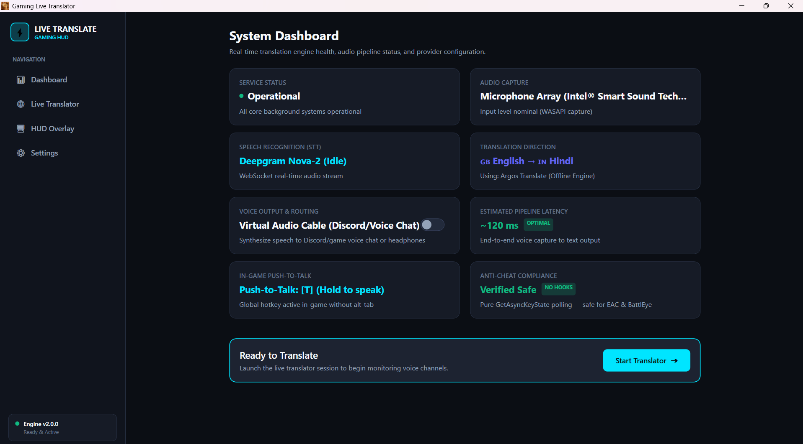
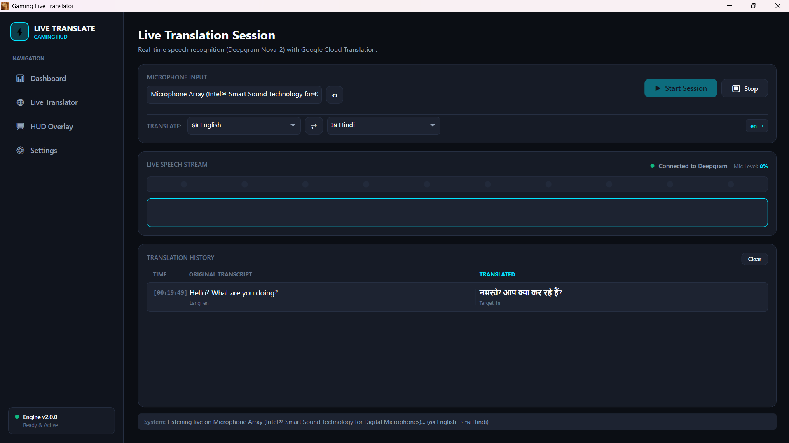
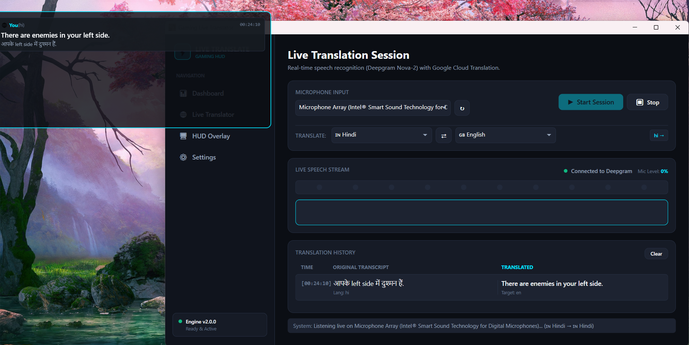
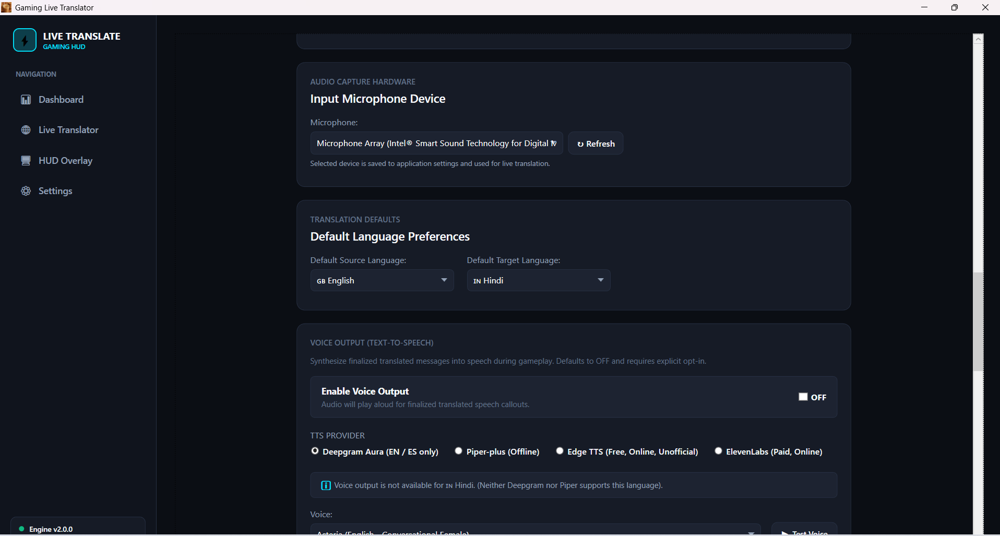

# 🎮 Gaming Live Translator

### Real-time voice translation for gamers

Gaming Live Translator is a Windows desktop application designed to help
gamers communicate across different languages using real-time speech
recognition, translation, text-to-speech, and audio routing.

---

## ⬇️ Download

### 🪟 Windows

**[⬇️ Download Gaming Live Translator v2.0.0]([https://github.com/kunsahil42-cpu/translator/releases/tag/v2.0.0])**

> **Current Release: v2.0.0**

Normal users only need to download the Windows release.
You do not need to download or build the source code.

---

## ✨ Features

- 🎙️ Real-time speech recognition
- 🌐 Multi-provider translation
- 🔊 Multiple text-to-speech providers
- 🎧 Microphone and audio routing
- 🎮 Gaming-focused workflow
- 🪟 In-game translation overlay
- ⌨️ Global hotkey support
- ⚙️ Provider and API configuration
- 📴 Local translation options
- 🔊 Local and cloud TTS options
- 🔐 Secure credential storage
- 📊 Service and connection status handling

---

## 🔄 Translation Pipeline

```text
┌──────────────────────┐
│     🎙️ Microphone    │
└──────────┬───────────┘
           │
           ▼
┌──────────────────────┐
│ 🧠 Speech Recognition │
└──────────┬───────────┘
           │
           ▼
┌──────────────────────┐
│   🌐 Translation      │
└──────────┬───────────┘
           │
           ▼
┌──────────────────────┐
│   🔊 Text-to-Speech   │
└──────────┬───────────┘
           │
           ▼
┌──────────────────────┐
│    🎧 Audio Output    │
└──────────────────────┘
````

The application separates speech recognition, translation, text-to-speech,
and audio services so that different providers can be configured
independently.

---

## 🧩 Supported Services

### 🎙️ Speech Recognition

* Deepgram

### 🌐 Translation

* Google Translate
* Lecto Translate
* Local Argos Translate

### 🔊 Text-to-Speech

#### Cloud / Online

* ElevenLabs
* Deepgram TTS
* Edge TTS

#### Local / Offline

* Piper TTS

### 🎧 Audio

* Microphone capture
* Virtual audio routing
* Windows audio devices

---

## 🖥️ Application

Gaming Live Translator provides a Windows desktop interface with dedicated
views for the main application workflow.

### Main Components

* 📊 Dashboard
* 🎙️ Translator
* 🪟 Translation Overlay
* ⚙️ Settings
* 🔑 Provider Configuration

---

## 🏗️ Architecture

```text
                    ┌─────────────────────┐
                    │    WPF Interface    │
                    │ Dashboard / Overlay │
                    │ Settings / Controls │
                    └──────────┬──────────┘
                               │
                               ▼
                    ┌─────────────────────┐
                    │     ViewModels      │
                    └──────────┬──────────┘
                               │
             ┌─────────────────┼─────────────────┐
             │                 │                 │
             ▼                 ▼                 ▼
      ┌─────────────┐   ┌─────────────┐   ┌─────────────┐
      │    Audio    │   │   Speech    │   │ Translation │
      │   Services  │   │ Recognition │   │   Services  │
      └─────────────┘   └─────────────┘   └──────┬──────┘
                                                  │
                                                  ▼
                                           ┌─────────────┐
                                           │     TTS     │
                                           │   Services  │
                                           └──────┬──────┘
                                                  │
                                                  ▼
                                           🔊 Audio Output
```

---

## 🔌 Service Architecture

The application uses interfaces and separate service implementations for
major components.

```text
Audio
├── Microphone Service
└── Virtual Audio Routing

Configuration
├── Settings Service
└── Secure Credential Store

Speech
├── Speech-to-Text Interface
├── Deepgram Speech Service
└── Deepgram Validator

Translation
├── Translation Service
├── Google Translate Validator
├── Lecto Translation Service
├── Lecto Validator
├── Local Argos Translation
└── Translation Pool

Text-to-Speech
├── ElevenLabs
├── Deepgram TTS
├── Edge TTS
├── Piper TTS
├── TTS Playback
└── TTS Process Management

Hotkeys
└── Global Hotkey Service
```

This modular structure makes it possible to maintain or extend individual
services without redesigning the entire application.

---

## 📁 Project Structure

```text
GamingLiveTranslator/
│
├── Models/
│   ├── ApiSettings.cs
│   ├── ArgosPackageItem.cs
│   ├── AudioDevice.cs
│   ├── ConnectionStatus.cs
│   ├── Language.cs
│   ├── TranslationMessage.cs
│   ├── TranslationProviderEntry.cs
│   └── TtsModels.cs
│
├── Resources/
│   ├── PythonRuntime/
│   │   ├── EDGE_TTS_LICENSE.txt
│   │   ├── translate_server.py
│   │   └── tts_server.py
│   │
│   └── Styles/
│       ├── Colors.xaml
│       └── Styles.xaml
│
├── Services/
│   │
│   ├── Audio/
│   │   ├── AudioCapturedEventArgs.cs
│   │   ├── CaptureErrorEventArgs.cs
│   │   ├── IMicrophoneService.cs
│   │   ├── IVirtualAudioRoutingService.cs
│   │   ├── MicrophoneService.cs
│   │   └── VirtualAudioRoutingService.cs
│   │
│   ├── Configuration/
│   │   ├── ISecureCredentialStore.cs
│   │   ├── SecureCredentialStore.cs
│   │   └── SettingsService.cs
│   │
│   ├── Hotkeys/
│   │   └── GlobalHotkeyService.cs
│   │
│   ├── Speech/
│   │   ├── DeepgramSpeechService.cs
│   │   ├── DeepgramValidator.cs
│   │   ├── IDeepgramValidator.cs
│   │   └── ISpeechToTextService.cs
│   │
│   ├── TextToSpeech/
│   │   ├── DeepgramTtsService.cs
│   │   ├── EdgeTtsService.cs
│   │   ├── ITextToSpeechService.cs
│   │   ├── PiperProcessManager.cs
│   │   ├── PiperTtsService.cs
│   │   ├── TextToSpeechService.cs
│   │   └── TtsPlaybackService.cs
│   │
│   └── Translation/
│       ├── ArgosProcessManager.cs
│       ├── GoogleTranslateValidator.cs
│       ├── IGoogleTranslateValidator.cs
│       ├── ILectoTranslateValidator.cs
│       ├── ITranslationPoolService.cs
│       ├── ITranslationService.cs
│       ├── LectoTranslateValidator.cs
│       ├── LectoTranslationService.cs
│       ├── LocalArgosTranslationService.cs
│       ├── TranslationFailureType.cs
│       ├── TranslationPoolService.cs
│       └── TranslationService.cs
│
├── Utilities/
│   ├── BooleanToStatusConverter.cs
│   ├── ChildProcessJob.cs
│   ├── Logger.cs
│   ├── ObservableObject.cs
│   ├── PasswordBoxHelper.cs
│   ├── RelayCommand.cs
│   └── WindowInteropHelpers.cs
│
├── ViewModels/
│   ├── DashboardViewModel.cs
│   ├── MainViewModel.cs
│   ├── OverlayViewModel.cs
│   ├── ProviderCredentialViewModel.cs
│   ├── SettingsViewModel.cs
│   ├── TranslationProviderItemViewModel.cs
│   ├── TranslatorViewModel.cs
│   └── ViewModelBase.cs
│
├── Views/
│   ├── Controls/
│   │   └── ProviderApiKeyCard.xaml
│   │
│   ├── DashboardView.xaml
│   ├── DashboardView.xaml.cs
│   ├── MainWindow.xaml
│   ├── MainWindow.xaml.cs
│   ├── OverlayView.xaml
│   ├── OverlayView.xaml.cs
│   ├── OverlayWindow.xaml
│   ├── OverlayWindow.xaml.cs
│   ├── SettingsView.xaml
│   ├── SettingsView.xaml.cs
│   ├── TranslatorView.xaml
│   └── TranslatorView.xaml.cs
│
├── scripts/
│   └── setup_offline_runtime.bat
│
├── App.xaml
├── App.xaml.cs
├── GamingLiveTranslator.csproj
└── GamingLiveTranslator.sln
```

---

## 🛠️ Technology Stack

| Component           | Technology                       |
| ------------------- | -------------------------------- |
| Desktop Application | C# / .NET                        |
| User Interface      | WPF / XAML                       |
| Architecture        | MVVM                             |
| Speech Recognition  | Deepgram                         |
| Translation         | Google Translate                 |
| Translation         | Lecto Translate                  |
| Local Translation   | Argos Translate                  |
| Cloud TTS           | ElevenLabs / Deepgram / Edge TTS |
| Local TTS           | Piper                            |
| Audio               | Windows Audio Services           |
| Runtime Support     | Python                           |
| Configuration       | C# Services                      |
| Credential Handling | Secure Credential Store          |

---

## 📦 Installation

### 👤 Normal Users

1. Open the **Releases** section.
2. Download the latest Windows release.
3. Run Gaming Live Translator.
4. Configure your microphone and audio devices.
5. Configure your translation provider.
6. Configure your TTS provider if required.
7. Start translating.

> **You do not need to clone the repository or install the development
> environment to use the released application.**

### ⬇️ Latest Release

**[Download Gaming Live Translator v2.0.0](https://github.com/kunsahil42-cpu/translator/releases/tag/v2.0.0)**

---

## 💻 Development

Developers who want to inspect, modify, or build the application can use
the source code in this repository.

### Requirements

* Windows
* .NET SDK compatible with the project
* Visual Studio 2022 or compatible .NET development environment
* Required project dependencies

### Clone

```powershell
git clone https://github.com/kunsahil42-cpu/translator.git
cd translator
```
### Run

```powershell
dotnet run --project GamingLiveTranslator/GamingLiveTranslator.csproj
```

---

## 🧪 Development Build

To run the application directly from Visual Studio:

1. Open `GamingLiveTranslator.sln`.
2. Select the appropriate build configuration.
3. Set `GamingLiveTranslator` as the startup project.
4. Build the solution.
5. Start the application.

---

## 🔐 Security

Gaming Live Translator may require API credentials for cloud services such
as speech recognition, translation, and text-to-speech.

### Important

**Never commit API keys, passwords, tokens, or other private credentials
to GitHub.**

Before creating a commit or release, verify that:

* API keys are not included.
* Passwords are not included.
* Private credentials are not included.
* Local configuration files are not committed.
* Personal data is not included.

---

## ⚠️ Known Limitations

Known limitations and technical notes are documented in:

**[KNOWN_LIMITATIONS.md](KNOWN_LIMITATIONS.md)**

---

## 📋 Version

### Current Release

# C2.0.0

Gaming Live Translator C2.0.0 is the current development/release version.

**[⬇️ Download Gaming Live Translator v2.0.0](https://github.com/kunsahil42-cpu/translator/releases/tag/v2.0.0)**

---

## 🚀 Project Status

Gaming Live Translator is currently in the **C2.0.0 release stage**.

The core application and major speech, translation, text-to-speech,
audio, overlay, configuration, and provider components are implemented.

Future updates may include additional providers, performance improvements,
bug fixes, UI refinements, and new features.

---

## 🗺️ Roadmap

Future development may include:

* Performance improvements
* Additional translation providers
* Additional speech providers
* Additional TTS providers
* UI improvements
* Improved gaming integrations
* Additional language support
* Improved offline capabilities
* Bug fixes and stability improvements

---

## 🤝 Contributing

Contributions, suggestions, and bug reports are welcome.

Before submitting a change:

1. Create a separate branch.
2. Make your changes.
3. Test the application.
4. Make sure no credentials or private files are included.
5. Submit a pull request with a clear description.

---

## 🐛 Bug Reports

When reporting a problem, include:

* Windows version
* Application version
* Relevant provider
* Steps to reproduce the issue
* Error message or logs
* Expected behavior
* Actual behavior

**Do not include API keys, passwords, or other sensitive information.**

---

## 📄 License

See the project's license file for information about using, modifying,
and distributing the software.

---

## 👨‍💻 Developer

**Sahil Kun**

GitHub:

[https://github.com/kunsahil42-cpu](https://github.com/kunsahil42-cpu)

---

## ⭐ Support the Project

If you find Gaming Live Translator useful or interesting, consider giving
the repository a ⭐ star.

Thank you for checking out **Gaming Live Translator**! 🎮🌐

---

## 📸 Screenshots

### 📊 Dashboard



### 🎙️ Translator



### 🪟 Translation Overlay



### ⚙️ Settings



---